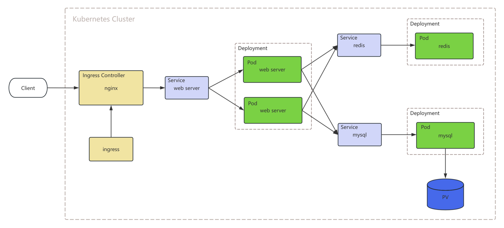

# Kubernetes 部署实践 demo
## 部署架构

## 环境准备
- Golang v1.22.1+
- docker
- kubernetes
- Kubectl

### Docker & Kubernetes
方便起见，可以直接安装 docker desktop， 并开启开启 enable kubernetes 功能。

### Kubectl
打开网站 https://kubernetes.io/docs/tasks/tools/ 找到你对应的平台，比如说我是 macos + apple intel。执行对应的命令就可以了。

执行如下命令判断 Kubectl 工具 和 Kubernetes 集群安装成功：  
kubectl cluster-info

## 实践步骤

### 1. 准备 Web Server 镜像
在项目目录下执行如下 make 编译命令:  
make docker  
该操作会生成 Golang 可执行文件，并打包生成 Docker 镜像

docker images 可以看到生成的镜像

由于 Web Server 启动依赖 Mysql 和 Redis，所以先部署 Mysql 和 Redis 

### 2. 部署 Mysql
Mysql 需要存储数据，我们需要为它分配一个存储空间  

2.1 首先要创建一个 PV，用于分配一块指定条件的存储空间：  
kubectl apply -f ./deployments/k8s/mysql-pv.yaml  

查看创建好的 PV：  
kubectl get pv

2.2 接着创建一个 PVC，用于声明 Mysql 对存储空间的要求  
kubectl apply -f ./deployments/k8s/mysql-pvc.yaml

查看创建好的 PVC：  
kubectl get pvc

2.3 接着创建 Mysql Deployment：  
kubectl apply -f ./deployments/k8s/mysql-deployment.yaml

查看创建好的 Mysql 服务：

kubectl get deployment | grep mysql

kubectl get pod | grep mysql

2.4 最后创建 Mysql Service：  
kubectl apply -f ./deployments/k8s/mysql-service.yaml

查看创建好的 Service：  
kubectl get svc | grep mysql

2.5 通过 mysql-service.yaml 文件可以查看 Mysql 的端口，k8s 集群内部的端口是 ports.port，外部访问的端口是 ports.nodePort  
可以使用数据库连接工具测试 Mysql 服务是否正常：  

### 3. 部署 Redis
3.1 创建 Redis Deployment：  
kubectl apply -f ./deployments/k8s/redis-deployment.yaml

查看创建好的 Mysql 服务：

kubectl get deployment | grep redis

kubectl get pod | grep redis

3.2 创建 Redis Service：  
kubectl apply -f ./deployments/k8s/redis-service.yaml

查看创建好的 Service：  
kubectl get svc | grep redis

3.3 通过 redis-service.yaml 文件可以查看 Redis 的端口，k8s 集群内部的端口是 ports.port，外部访问的端口是 ports.nodePort  
可以使用数据库连接工具测试 Redis 服务是否正常：  

### 4. 启动 Web Server
4.1 创建 WebServer Deployment：  
kubectl apply -f ./deployments/k8s/demo-deployment.yaml

查看创建好的 WebServer 服务：
kubectl get deployment | grep demo

kubectl get pod | grep demo

4.2 创建 WebServer Service：  
kubectl apply -f ./deployments/k8s/demo-service.yaml

查看创建好的 Service：  
kubectl get svc | grep demo

### 5. 部署 Ingress Controller
我们使用 ingress-nginx 作为 Ingress Controller

5.1 安装 helm  
curl -fsSL -o get_helm.sh https://raw.githubusercontent.com/helm/helm/main/scripts/get-helm-3  
chmod 700 get_helm.sh  
./get_helm.sh

5.2 使用 helm 安装 ingress-nginx：  
helm upgrade --install ingress-nginx ingress-nginx --repo https://kubernetes.github.io/ingress-nginx --namespace ingress-nginx --create-namespace

5.3 查看创建好的 ingress-nginx：  
kubectl get deployment -n ingress-nginx

kubectl get pod -n ingress-nginx

5.4 ingress-nginx 默认开启 80 和 443 端口，可以通过浏览器测试启动是否正常

返回 404 说明 nginx 正常启动

### 6. 创建 ingress  
kubectl apply -f ./deployments/k8s/ingress.yaml

查看创建好的 ingress：  

### 7. 测试服务功能
以上所有的服务都部署完毕，浏览器访问如下 url 测试服务是否正常：  
- http://localhost/hello
- http://localhost/set_redis
- http://localhost/get_redis
- http://localhost/set_mysql
- http://localhost/get_mysql

正常返回如下：  

### 8. 使用 helm 一键部署完整服务
8.1 停止上述启动的 WebServer、Mysql、Redis、Ingress  
kubectl delete -f ./deployments/k8s/.

8.2 创建一个新的命名空间，便于管理  
kubectl create namespace k8s-demo

8.2 使用 helm 启动 WebServer、Mysql、Redis、Ingress  
helm install demo ./deployments/helm/demo -n k8s-demo

查看 helm release：  
helm list -n k8s-demo

查看服务部署情况：  
kubectl get pod -n k8s-demo  
kubectl get service -n k8s-demo  
kubectl get ingress -n k8s-demo  

### 9. 测试服务功能
同第 7 步

### 10. 使用 helm 停止服务
kubectl get pod -n k8s-demo
